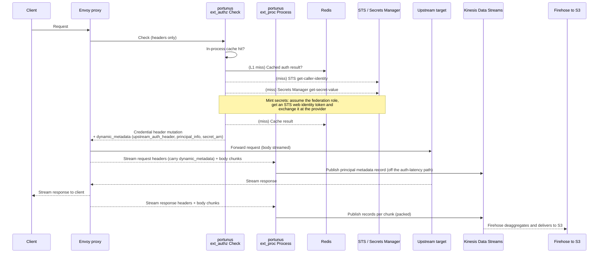

# Portunus


**Portunus** is a secure API key proxy. Clients authenticate with temporary AWS credentials and Portunus transparently swaps them for the real API key stored in AWS Secrets Manager before forwarding requests to upstream targets. Traffic is published to Kinesis Data Streams for best-effort auditing; monitor publication and capture-loss metrics.

It runs as two cooperating components:

- **Envoy proxy** (one deployment per target host). Envoy terminates the client's connection and applies a filter chain:
  - **`ext_authz`** calls Portunus's `Check` gRPC servicer with the request headers (never the body) to authenticate the request; Portunus returns the upstream credential and the header to write it to.
  - **`ext_proc`** streams request and response bodies — and post-101 WebSocket frames — to Portunus's `Process` gRPC servicer for audit publication.
- **Portunus backend**. A pure gRPC process (`python -m portunus.grpc.server`; the FastAPI service, Lua filter and Python WebSocket relay shipped up to 0.11.0) hosting the two servicers above plus the standard `grpc.health.v1.Health` and reflection services. Envoy answers `/ping` (Envoy process liveness) and `/healthz` (gated on Portunus's gRPC health service, default service `""` — the ALB health-check target); flushing the shared auth cache is an operator runbook — see [`docs/runbooks/flush-auth-cache.md`](docs/runbooks/flush-auth-cache.md) — not an HTTP endpoint:
  - Decodes the base64-encoded payload in the client's `Authorization` header — `{credentials, secret_arn}` — and uses those AWS credentials to fetch the real API key from Secrets Manager, or to mint a short-lived token for the `*_wif` secret types. Results are cached in process and in Redis. Deployments must configure network access and IAM permissions for their intended trust boundary.
  - Secrets can be stored as plaintext (`"sk-…"`) or as JSON with a target-host check (`{"secret":"sk-…","host":"api.openai.com"}`); the latter only authorises for matching upstreams.
  - Returns the real key as a header mutation; Envoy applies it before forwarding upstream.
  - Streams metadata, headers, and bodies to per-stream Kinesis data streams; a Firehose per stream archives them in S3.

Supporting AWS services:

- **Kinesis Data Streams → Firehose** for the audit pipeline. Portunus packs audit records (newline-delimited, up to 256 KiB / 500 per KDS record) under random partition keys; Firehose deaggregates them before partitioning and delivery.
- **AWS Secrets Manager** for the real API keys, and **STS** to verify callers and to assume federation roles.
- **Redis** for the shared auth cache.
- **CloudWatch Logs** for the structured logs and the embedded (EMF) metrics
  Portunus writes to stdout.

## Data flow


```mermaid
sequenceDiagram
    participant Client
    participant Envoy as Envoy proxy
    participant Auth as portunus<br/>ext_authz Check
    participant Proc as portunus<br/>ext_proc Process
    participant Redis
    participant AWS as STS / Secrets Manager
    participant Target as Upstream target
    participant KDS as Kinesis Data Streams
    participant FH as Firehose to S3

    Client->>Envoy: Request
    Envoy->>Auth: Check (headers only)
    Auth->>Auth: In-process cache hit?
    Auth->>Redis: (L1 miss) Cached auth result?
    Auth-->>AWS: (miss) STS get-caller-identity
    Auth-->>AWS: (miss) Secrets Manager get-secret-value
    Note over Auth,AWS: Mint secrets: assume the federation role,<br/>get an STS web identity token and<br/>exchange it at the provider
    Auth-->>Redis: (miss) Cache result
    Auth-->>Envoy: Credential header mutation<br/>+ dynamic_metadata (upstream_auth_header, principal_info, secret_arn)

    Envoy->>Target: Forward request (body streamed)
    Envoy-->>Proc: Stream request headers (carry dynamic_metadata) + body chunks
    Proc->>KDS: Publish principal metadata record (off the auth-latency path)
    Target-->>Envoy: Stream response
    Envoy-->>Client: Stream response to client
    Envoy-->>Proc: Stream response headers + body chunks
    Proc->>KDS: Publish records per chunk (packed)
    KDS-->>FH: Firehose deaggregates and delivers to S3
```

## Security model

Envoy reaches Portunus over gRPC and presents the proxy's `PORTUNUS_API_KEY` as `x-portunus-proxy-key` metadata on every call. Both servicers reject calls whose key does not match the backend's `GRPC_PROXY_API_KEY`, which must be at least 16 bytes; an empty key is accepted only with `GRPC_PROXY_API_KEY_OPTIONAL=true` (and `PORTUNUS_API_KEY_OPTIONAL=true` on the proxy), for local development. The target host Portunus authorises against comes from Envoy's configuration, never from the client's request.

`GRPC_HOST` defaults to `127.0.0.1` for the sidecar topology. The standard health and reflection services do not check the key, so if Portunus listens beyond loopback, restrict network reachability to the proxies. Do not expose Portunus directly to clients or the public internet.

### Logged data

Portunus captures **full request and response data** and publishes it to Kinesis for the audit trail. This is deliberate: the logs are an audit record of everything that passed through the proxy. Be aware that this means:

- **Request and response bodies are stored verbatim**, including prompts, completions, WebSocket messages, and any data (personal, commercial, or otherwise sensitive) that clients send or receive.
- **Headers are captured in full except credential headers**: `KNOWN_AUTH_HEADERS` (a backend setting, default `authorization,x-api-key,x-goog-api-key,api-key`, matched case-insensitively), `API_KEY_HEADER`, and the header the upstream credential was written to are never captured; every other header, custom `x-aisi-*` headers included, is. Extend `KNOWN_AUTH_HEADERS` for any other credential header your clients send. Secrets embedded in a URL path or query, or in a body, **will be captured**.

For minted tokens, each mint writes one log line pairing the `jti` of the STS identity token (which providers record when they exchange it) with the federation role ARN and the caller's user, principal, session and project. A provider-side record is matched to the caller through that line, and to the caller's requests through the per-request logs for the token's lifetime; the tokens themselves are not logged.

Portunus does **not** attempt to redact secrets or sensitive content from bodies. If you need redaction, filtering, or access tiering, do it downstream of the Kinesis streams (e.g. in the ETL/query layer that consumes the logs) and restrict who can read the raw stream output. Treat the raw log storage as containing everything your clients send and receive.

## Configuration

### Environment variables

| Variable | Description | Default |
|---|---|---|
| `AWS_DEFAULT_REGION` | AWS region for all service clients, including the regional STS endpoint federation mints through (ECS sets it) | *(required)* |
| `API_KEY_HEADER` | Header name carrying the encoded payload | `authorization` |
| `API_KEY_PREFIX` | Prefix on the header value | `Bearer ` |
| `KNOWN_AUTH_HEADERS` | Comma-separated credential headers left out of audit header capture (case-insensitive) | `authorization,x-api-key,x-goog-api-key,api-key` |
| `PORTUNUS_HEADER_PREFIX` | Prefix for proxy response headers (`x-{prefix}-*`) | `portunus` |
| `GRPC_ENABLED` | Required to be `true` for this gRPC-only image | `false` |
| `GRPC_HOST` | Interface the gRPC server binds to. Loopback by default for the sidecar topology where Envoy reaches Portunus on localhost. Set to `0.0.0.0` if Envoy and Portunus run in separate network namespaces. | `127.0.0.1` |
| `GRPC_PORT` | gRPC server listen port | `9000` |
| `GRPC_PROXY_API_KEY` | Key of at least 16 bytes matching proxy `PORTUNUS_API_KEY`; see [Security model](#security-model) | - |
| `GRPC_PROXY_API_KEY_OPTIONAL` | When `true`, allow an empty `GRPC_PROXY_API_KEY` (dev only) | `false` |
| `GRPC_AUDIT_PORT` / `GRPC_ROLE` / `GRPC_AUDIT_DROP_ON_PRESSURE` | Audit isolation: a separate `ext_proc` port, an `auth`/`audit`/`all` process role, and dropping audit instead of waiting when the queue is full. See [proxy/README.md](proxy/README.md#audit-overload-isolation) | unset / `all` / `false` |
| `CACHE_DURATION` | Upper bound on the authorisation cache TTL (seconds) | `86400` |
| `AUTH_LOCAL_CACHE_TTL_SECONDS` / `AUTH_LOCAL_CACHE_MAX_ENTRIES` | In-process auth cache in front of Redis: TTL (`0` disables) and its size | `30` / `10000` |
| `AUTH_FALLBACK_MAX_CONCURRENT` / `AUTH_FALLBACK_ACQUIRE_TIMEOUT_S` | Concurrent full authentications (STS + Secrets Manager) per process; requests waiting longer than the timeout get 503 | `32` / `1.0` |
| `REDIS_HOST` / `REDIS_PORT` / `REDIS_PASSWORD` | Redis connection settings | `localhost` / `6379` / - |
| `REDIS_MAX_CONNECTIONS` | Max Redis connections | `200` |
| `REDIS_POOL_TIMEOUT_SECONDS` / `REDIS_HEALTH_CHECK_INTERVAL_SECONDS` | Wait for a pooled Redis connection; idle-connection health-check interval | `1.0` / `30` |
| `REDIS_USE_TLS` | TLS to Redis | `true` |
| `KINESIS_METADATA_STREAM` | Kinesis data stream for principal metadata records | *(required)* |
| `KINESIS_REQUEST_HEADERS_STREAM` / `KINESIS_REQUEST_BODY_STREAM` / `KINESIS_REQUEST_TRAILERS_STREAM` | Request-side Kinesis data streams | *(all required)* |
| `KINESIS_RESPONSE_HEADERS_STREAM` / `KINESIS_RESPONSE_BODY_STREAM` / `KINESIS_RESPONSE_TRAILERS_STREAM` | Response-side Kinesis data streams | *(all required)* |
| `KINESIS_WS_SUMMARY_STREAM` | Per-connection WebSocket summary records (`WSSummaryRecord`) | - |
| `KINESIS_MAX_RECORD_SIZE` | Max bytes per audit record; larger payloads are chunked | `1000000` |
| `METRICS_ENABLED` / `METRICS_NAMESPACE` / `METRICS_SERVICE_NAME` / `METRICS_FLUSH_INTERVAL_SECONDS` | CloudWatch EMF metrics; see [portunus/README.md](portunus/README.md#cloudwatch-emf-metrics) | `false` / `Portunus` / `portunus` / `60` |
| `RATE_LIMIT_PERCENT_ENABLED` / `RATE_LIMIT_INTERVAL_SECONDS` / `RATE_LIMIT_REQUESTS_PER_INTERVAL` | Optional rate limiting (proxy) | `0` / `1` / `1` |
| `FEDERATION_ALLOWED_ACCOUNT_IDS` | Comma-separated AWS account IDs whose federation roles a secret may name. Unset disables token minting | - |
| `FEDERATION_ROLE_PATH_PREFIX` | IAM path federation role ARNs must start with | `/portunus-fed/` |
| `FEDERATION_STS_ENDPOINT_URL` | STS endpoint for federation calls. Defaults to `AWS_ENDPOINT_URL` if set, else `https://sts.<region>.amazonaws.com` | - |

### Secret formats

A secret referenced by a payload is one of:

| Format | Example | Behaviour |
|---|---|---|
| Plaintext | `sk-1234567890abcdef` | Used as the key for any target |
| Stored key with target check | `{"secret": "sk-...", "host": "api.example.com"}` | Used only when the proxy's target matches `host` |
| Minted token | `{"type": "anthropic_wif", ...}`, `{"type": "openai_wif", ...}`, `{"type": "openrouter_wif", ...}` or `{"type": "gcp_wif", ...}` (below) | No key is stored; a short-lived token is minted per caller |

JSON without a `type` is treated as a stored key (and, if it does not match that schema, used verbatim as the key); a typeless object with a `federation_role_arn` is a mint secret missing its `type` and is rejected rather than used as a key. JSON with a `type` must validate as that type; `static` names the stored-key form explicitly.

[docs/federation-examples.md](docs/federation-examples.md) sets up one grant per minted-token type with one set of example values: the federation role as CloudFormation, the lab-side registration, the config secret, and a request through the proxy.

#### `anthropic_wif`

```json
{
  "type": "anthropic_wif",
  "host": "api.anthropic.com",
  "federation_role_arn": "arn:aws:iam::123456789012:role/portunus-fed/projects/example/example-grant@projects.example",
  "federation_rule_id": "fdrl_01EXAMPLE",
  "organization_id": "11111111-1111-4111-8111-111111111111",
  "service_account_id": "svac_01EXAMPLE",
  "workspace_id": "wrkspc_01EXAMPLE",
  "audience": "https://api.anthropic.com"
}
```

`audience` (default shown) is optional; unknown fields are rejected. On a cache miss Portunus:

1. Verifies the caller with STS and fetches the secret, as for stored keys.
2. Checks `federation_role_arn` is `arn:aws:iam::<account>:role<FEDERATION_ROLE_PATH_PREFIX><name>` with `<account>` in `FEDERATION_ALLOWED_ACCOUNT_IDS`; `<name>` is any further IAM path plus the role name. Nothing else is called if this fails.
3. Assumes the federation role with the caller's own credentials (`RoleSessionName` is the caller's IAM role name) through the regional STS endpoint, then from that session requests an STS web identity token for `audience`. The token carries no request tags.
4. Exchanges the token at `https://api.anthropic.com/v1/oauth/token` (RFC 7523 JWT bearer grant, with the four identifiers above) and returns the bearer token with `output_header: "authorization"` and `output_prefix: "Bearer "`.

If STS or the token endpoint cannot be reached or answers 5xx/429, or steps 3–4 take longer than 6 s, Portunus denies the request with 503 rather than 403.

Every exchange uses a freshly issued STS token.

#### `openai_wif`

```json
{
  "type": "openai_wif",
  "host": "api.openai.com",
  "federation_role_arn": "arn:aws:iam::123456789012:role/portunus-fed/projects/example/example-grant@projects.example",
  "identity_provider_id": "idp_01EXAMPLE",
  "service_account_id": "svc_acct_01EXAMPLE",
  "audience": "https://api.openai.com/v1"
}
```

`audience` (default shown) is optional and must equal the audience configured on the OpenAI workload identity provider `identity_provider_id`; `service_account_id` is the OpenAI service account the token acts as. Service accounts created in the dashboard may show a `user-…` id rather than `svc_acct_…`; either is accepted. Both ids are `[A-Za-z0-9_-]+`. Steps 1–3 are as for `anthropic_wif`, except that the STS token is signed with ES384 rather than RS256 (OpenAI's documented preference); then Portunus:

4. Exchanges the token at `https://auth.openai.com/oauth/token` (RFC 8693 token exchange; JSON body with `grant_type` `urn:ietf:params:oauth:grant-type:token-exchange`, `subject_token_type` `urn:ietf:params:oauth:token-type:jwt`, `subject_token`, `identity_provider_id` and `service_account_id`) and returns `access_token` with `output_header: "authorization"` and `output_prefix: "Bearer "`. Expiry comes from `expires_in`.

OpenAI issues the access token for at most an hour and never beyond the STS token's expiry, so Portunus requests a 30-minute STS token here (`anthropic_wif` requests 15 minutes, which Anthropic doubles) and the access token lives about 30 minutes and is cached for about 29. As for `anthropic_wif`, an unreachable endpoint, a 5xx/429 answer or a missed 6 s deadline returns 503.

On the OpenAI side, all deployment concerns: the federation role's account must have outbound web identity federation enabled, and the workload identity provider's OIDC issuer is that account's STS issuer URL, with `audience` as its audience. The service account mapping matches the token's `sub`, which is the federation role's IAM ARN (`federation_role_arn`). The federation role's identity policy must allow `sts:GetWebIdentityToken` for `audience` with `sts:DurationSeconds` of at least 1800; OpenAI's example policy caps it at 300.

#### `openrouter_wif`

```json
{
  "type": "openrouter_wif",
  "host": "openrouter.ai",
  "federation_role_arn": "arn:aws:iam::123456789012:role/portunus-fed/projects/example/example-grant@projects.example",
  "federation_policy_id": "00000000-0000-4000-8000-000000000000",
  "audience": "https://openrouter.ai/api/v1"
}
```

`audience` (default shown) is optional and must equal the audience configured on the OpenRouter federation policy `federation_policy_id` (the policy's UUID). Steps 1–3 are as for `anthropic_wif`, with the STS token signed with RS256 (OpenRouter accepts RS256 or ES256, and STS signs RS256 or ES384); then Portunus:

4. Exchanges the token at `https://openrouter.ai/api/v1/oauth/token` (RFC 8693 token exchange; form-encoded body with `grant_type` `urn:ietf:params:oauth:grant-type:token-exchange`, `subject_token_type` `urn:ietf:params:oauth:token-type:jwt`, `subject_token` and `federation_policy_id`) and returns `access_token` with `output_header: "authorization"` and `output_prefix: "Bearer "`. Expiry comes from `expires_in`.

OpenRouter issues the access token for at most 15 minutes and never beyond the STS token's expiry, so Portunus requests a 15-minute STS token here; the access token lives about 15 minutes and is cached for about 14. As for `anthropic_wif`, an unreachable endpoint, a 5xx/429 answer or a missed 6 s deadline returns 503.

On the OpenRouter side, all deployment concerns: workload identity federation is available on OpenRouter's Business and Enterprise plans. The federation policy's issuer is the federation role's account's STS issuer URL, its subject is the token's `sub`, the federation role's IAM ARN (`federation_role_arn`), and its audience is `audience`. The API key the policy acts as receives the usage. The access token carries that `sub` together with `federation_policy_id` and `federation_issuer_id`. The federation role's identity policy must allow `sts:GetWebIdentityToken` for `audience`.

#### `gcp_wif`

```json
{
  "type": "gcp_wif",
  "host": "aiplatform.googleapis.com",
  "federation_role_arn": "arn:aws:iam::123456789012:role/portunus-fed/projects/example/example-grant@projects.example",
  "audience": "//iam.googleapis.com/projects/123456789/locations/global/workloadIdentityPools/example-pool/providers/example-provider",
  "service_account": "example-sa@example-project.iam.gserviceaccount.com",
  "scopes": ["https://www.googleapis.com/auth/cloud-platform"],
  "token_lifetime_seconds": 3600
}
```

`scopes` (default shown) and `token_lifetime_seconds` (600–3600, default 3600) are optional. `audience` must be a pool provider resource name in the form shown and `service_account` an email address. Steps 1–3 are as for `anthropic_wif`, with the STS token (RS256, 15 minutes) requested for `audience`; then Portunus:

4. Exchanges the token at `https://sts.googleapis.com/v1/token` (RFC 8693 token exchange; form-encoded body with `grant_type` `urn:ietf:params:oauth:grant-type:token-exchange`, `subject_token_type` `urn:ietf:params:oauth:token-type:jwt`, `subject_token`, `audience`, `scope` `https://www.googleapis.com/auth/iam` and `requested_token_type` `urn:ietf:params:oauth:token-type:access_token`) for a federated token, then calls `https://iamcredentials.googleapis.com/v1/projects/-/serviceAccounts/<service_account>:generateAccessToken` with `scopes` and `token_lifetime_seconds`. The access token is returned with `output_header: "authorization"` and `output_prefix: "Bearer "`. Expiry comes from `expireTime`.

As for `anthropic_wif`, an unreachable Google endpoint, a 5xx/429 answer or a missed 6 s deadline returns 503.

On the Google side, all deployment concerns: the workload identity pool provider is an OIDC provider whose issuer is the federation role's account's STS issuer URL and whose allowed audience is the provider's own resource name, the secret's `audience`. The token's `sub` is the federation role's IAM ARN including its path (`federation_role_arn`), so the attribute mapping derives `google.subject` from `assertion.sub` with an `extract` that keeps it within Google's 127-character subject limit, and the attribute condition matches the role path prefix. The service account must grant `roles/iam.workloadIdentityUser` to the pool principal the mapping produces. The federation role's identity policy must allow `sts:GetWebIdentityToken` for `audience`, as for the other minted types.

#### Caching and the federation role

A stored key is cached until the earlier of `CACHE_DURATION` and the caller's credential expiry; a minted token is also never cached past one minute before it expires. The same limits apply to the in-process cache. Concurrent cache misses for one payload and target share a single mint per Portunus process.

The federation role itself (trust policy, identity policy, who may assume it) is a deployment concern, as is how roles under the prefix are named. The secret names the role; Portunus checks the account and prefix and assumes exactly that role. To issue the identity token, the role's identity policy must allow `sts:GetWebIdentityToken` for the secret's `audience` (`sts:IdentityTokenAudience`). The CLI's default session policy allows `sts:AssumeRole` and `sts:TagSession` on the whole prefix, `arn:aws:iam::<caller account>:role/portunus-fed/*`, so which roles a caller can actually assume is bounded by the caller's own identity policy and each role's trust policy. The caller and federation trust policies must also allow session tagging for credentials with inherited transitive tags, such as EKS Pod Identity credentials. Pass `--federation-role-path` if the deployment uses a different path. The CLI assumes the caller's own role with `RoleSessionName` `portunus`; pass `--session-name` when that role's trust policy only admits a particular session name.

## Local development

### Setup

```bash
uv sync
```

### Running locally

```bash
docker compose up --build
```

By default the proxy points at an included [httpbun](https://httpbun.com/) instance. Send a request through the stack:

```bash
TOKEN=$(python - <<'PY'
import base64
import json

payload = {
    "credentials": {
        "access_key_id": "000000000000",
        "secret_access_key": "test",
        "session_token": "test",
    },
    "secret_arn": "arn:aws:secretsmanager:eu-west-2:000000000000:secret:test-api-key",
}
print(base64.b64encode(json.dumps(payload).encode()).decode())
PY
)
curl http://localhost:8888/headers -H "Authorization: Bearer $TOKEN"
```

### Constructing a payload

```python
from portunus.services.payload_service import encode_payload

# credentials dict from STS assume-role or get-session-token
payload = encode_payload(
    credentials, "arn:aws:secretsmanager:eu-west-2:123456789012:secret:my-api-key"
)
```

## Running tests

The test suite splits into two surfaces. The first runs in CI on every push and PR; the second needs Docker (and is slow) and runs in the same job after the unit tests pass.

### Unit tests (fast, in-CI)

```bash
cd portunus && uv run pytest -q
```

Covers the gRPC servicers (auth + proc) in isolation with `Fake*` collaborators, plus secrets / cache / federation / publish-queue logic and the schema-consistency check for the Glue ETL.

### Behaviour and end-to-end tests (slow, docker-compose required)

Bring the stack up once and run the broader suite from the repo root:

```bash
docker compose up --build --wait
uv run --group dev pytest tests/ -q
```

The same fixtures cover:

- `tests/test_http_proxy_behaviour.py` — parameterised HTTP corpus driven through Envoy → Portunus → httpbun. Auth, methods, headers, security adversarial cases.
- `tests/test_ws_proxy_behaviour.py` — WebSocket upgrade, frame round-trip, close-code propagation, abrupt-disconnect handling.
- `tests/test_e2e.py` — non-corpus HTTP behaviours (custom header prefix, error-response diagnostics).
- `tests/test_inspect_compat.py` — OpenAI SDK driven through Portunus via Inspect AI.
- `tests/test_redis_cache.py` — Redis cache TTL, and cache entries written before signing was removed (their `signing_key` is ignored).

Tests that need the Docker stack are tagged `@pytest.mark.slow`. CI runs both surfaces in `.github/workflows/test.yml`; the lint and type-check workflows skip the Docker-driven lane.

### CloudWatch integration

Portunus does not export traces. Per-request correlation rides on Envoy's
`x-request-id` (and the inbound `x-amzn-trace-id`, when present), which appears
on every structured log line, every audit record and every response; aggregate
behaviour comes from [CloudWatch embedded metrics
(EMF)](https://docs.aws.amazon.com/AmazonCloudWatch/latest/monitoring/CloudWatch_Embedded_Metric_Format.html)
that Portunus aggregates in-process and flushes to stdout once per
`METRICS_FLUSH_INTERVAL_SECONDS`. CloudWatch Logs extracts them with no agent
and no metric filter. Set `METRICS_ENABLED=true` to turn them on (off by
default, including in `docker-compose.yaml`, so local stdout stays readable).

For [CloudWatch](https://docs.aws.amazon.com/AmazonCloudWatch/latest/monitoring/WhatIsCloudWatch.html) integration to work locally, uncomment the logging settings for the relevant services and provide credentials in `~/.aws/credentials` (default profile). See `docker-compose.yaml`.

## Known issues

- **Audit record size**: Kinesis Data Streams caps a record at 1 MiB. Audit payloads larger than `KINESIS_MAX_RECORD_SIZE` are chunked automatically (one record per chunk), but Portunus holds queued records in memory, which can cause memory pressure under heavy load with large bodies; the publish queue's count and byte limits bound it, at the cost of dropped audit records.
- **Scaling lag**: Deployments must configure capacity and scaling. Rapid load increases can exhaust request capacity before additional instances become ready.

## Streaming

The proxy handles streaming responses (e.g. SSE from LLM APIs) efficiently:

- Request bodies are not buffered: authentication needs only the headers, so requests stream end to end.
- Responses stream directly to the client as they arrive. Each request and response body chunk is published as its own audit record with a monotonic `chunk_id`; downstream consumers must reassemble by `request_id`. A streamed body is complete iff its `chunk_id`s are contiguous from 0 through the record with `final_chunk=true`.
- WebSocket connections are proxied by Envoy and last at most 3,300 seconds.
- Envoy's `stream_idle_timeout` is set to 3600s for long-running streams.
